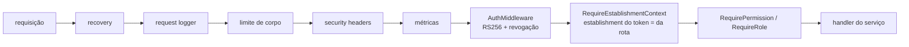
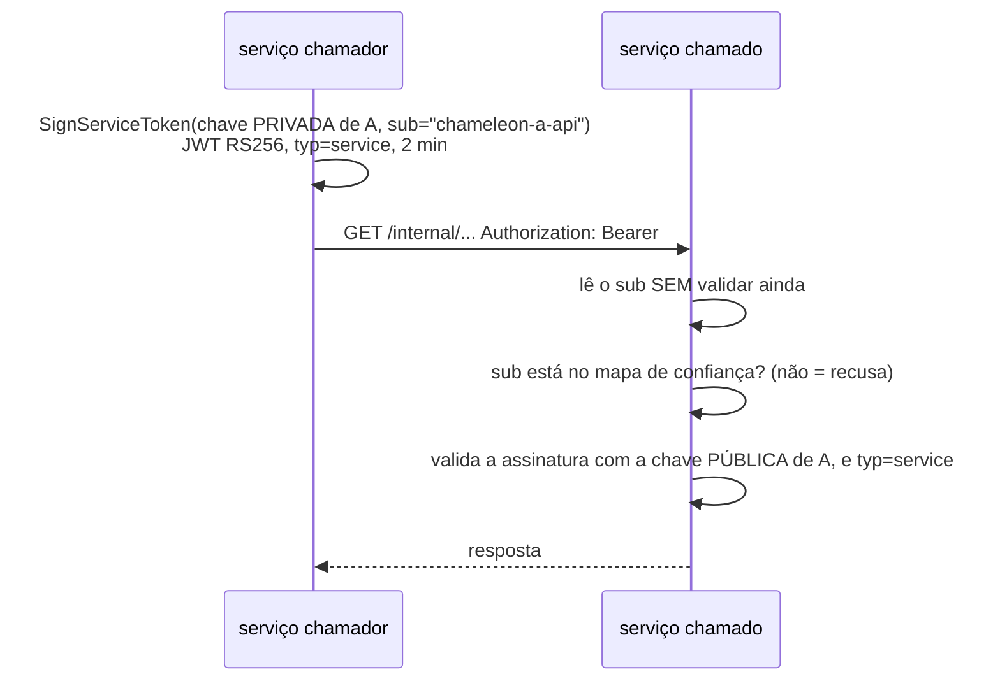
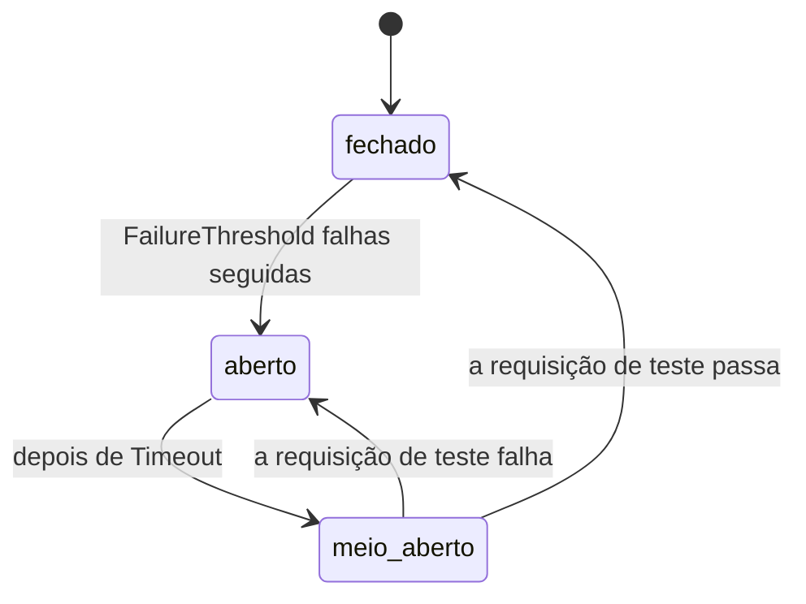

# chameleon-common

Biblioteca Go compartilhada pelos microsserviços do ecossistema Chameleon. Guarda
a **infraestrutura** que todo serviço precisa igual — autenticação de usuário e
de serviço, servidor HTTP, respostas de erro, circuit breaker, transação,
cache, métricas — para que cada serviço só escreva a própria regra de negócio.

Não entra aqui: regra de negócio de um serviço, acesso a banco de um domínio,
repositório concreto.

## Sumário

- [Pacotes](#pacotes)
- [Pipeline de uma requisição autenticada](#pipeline-de-uma-requisição-autenticada)
- [Autenticação de usuário](#autenticação-de-usuário)
- [Token de serviço (chamada interna)](#token-de-serviço-chamada-interna)
- [Circuit breaker](#circuit-breaker)
- [Transação: UnitOfWork](#transação-unitofwork)
- [Cache com invalidação por geração](#cache-com-invalidação-por-geração)
- [Respostas e erros](#respostas-e-erros)
- [Servidor HTTP e métricas](#servidor-http-e-métricas)
- [Versionamento e release](#versionamento-e-release)

## Pacotes

| pacote | o que entrega |
|---|---|
| `pkg/httpserver` | `*http.Server` padrão: recovery, request logger, limite de corpo, security headers, métricas, Swagger opcional e `/health` |
| `pkg/middleware` | autenticação de usuário (RS256 + revogação), papel, permissão, contexto do estabelecimento, token de serviço, security headers |
| `pkg/security` | assinatura e validação do token de serviço (RSA), carga de chaves PEM, verificador de revogação no Redis |
| `pkg/circuitbreaker` | circuit breaker genérico para chamada HTTP síncrona |
| `pkg/persistence` | `UnitOfWork`: transação em `domain`/`application` sem expor GORM |
| `pkg/cache` | cache no Redis com chave versionada e invalidação explícita |
| `pkg/redisclient` | cliente Redis a partir das variáveis padrão (`REDIS_*`) |
| `pkg/metrics` | Prometheus: métricas HTTP, contadores/gauges, medição de jobs, servidor de métricas do worker |
| `pkg/http` · `pkg/response` | respostas padrão (sucesso, paginação, erro) — mensagens em português |
| `pkg/validation` | validação de payload, validadores BR (`br_document`, `br_phone`, `br_zip`) |
| `pkg/money` | arredondamento e desconto (percentual ou valor fixo) — o vocabulário de desconto da plataforma |
| `pkg/log` | logger `zerolog` padronizado (serviço, ambiente, nível) |
| `pkg/base` | modelo e DTO base para entidades GORM (id, timestamps) |

## Pipeline de uma requisição autenticada



Tudo até `métricas` vem do `httpserver.New`; os três de autorização o serviço
monta nas próprias rotas.

## Autenticação de usuário

`AuthMiddleware` **valida o token de verdade**: assinatura RS256 contra a chave
pública do auth-api, expiração, `typ=access`, e a revogação no Redis. O Kong
também valida na borda, mas não é a única barreira — confiar só no gateway
amarraria a segurança à topologia de rede.

```go
publicKey, _ := security.LoadRSAPublicKeyFile(cfg.UserTokenPublicKeyPath)
redisClient, _ := redisclient.New(redisclient.FromEnv())
revocation := security.NewRedisRevocationChecker(redisClient, "meu-servico")

auth := middleware.AuthMiddleware(publicKey, revocation, revocation)

tenant := api.Group("/:establishmentID", auth, middleware.RequireEstablishmentContext())
tenant.GET("/stats", middleware.RequirePermission("dashboard.read"), handler)
```

- **Os três parâmetros são obrigatórios.** A função entra em pânico no boot se algum vier nil: autorização pela metade precisa ser impossível de montar. (Uma versão anterior aceitava nil, e seis serviços subiram sem revogação — deslogar não deslogava.)
- **Revogação** (escrita pelo auth-api, lida aqui): blacklist do `jti` (logout de um dispositivo) e `token_version` do usuário (derruba todas as sessões). Se o Redis não responder, a requisição passa e a métrica `auth_revocation_check_degraded_total` sobe — cache fora custa segurança temporária, não disponibilidade, e a métrica é o alarme.
- **`RequireEstablishmentContext`**: o `establishment_id` do token tem que ser o da rota; o admin da plataforma (`*` ou `platform.*`) atua em qualquer unidade.
- **`RequirePermission`** aceita igualdade exata e curingas (`*`, `appointments.*`); `RequireRole` para perfil fixo (`owner`).
- Leitura do contexto no handler: `middleware.RequireUserID(c)`, `RequireEstablishmentID(c)`, `RequireUUIDParam(c, "id")`.

## Token de serviço (chamada interna)



```go
// quem chama
token, _ := security.SignServiceToken(privateKey, "chameleon-meu-servico")

// quem recebe
trusted := map[string]*rsa.PublicKey{"chameleon-outro-servico": outroPublicKey}
internal := api.Group("/internal", middleware.ServiceTokenMiddleware(trusted))
```

Cada serviço tem o seu par de chaves (`make service-keys` no `chameleon-stack`).
Um `sub` fora do mapa é recusado mesmo com assinatura válida contra outra chave;
token de usuário nunca serve no lugar do de serviço (`typ` diferente).

## Circuit breaker



```go
cb := circuitbreaker.New(circuitbreaker.Settings{
    Name: "sales-agenda", MaxHalfOpenReqs: 1,
    Interval: 60 * time.Second, Timeout: 30 * time.Second, FailureThreshold: 5,
})
result, err := circuitbreaker.Execute(cb, func() (Result, error) { return call(ctx) })
```

Um breaker **por destino**: um serviço fora do ar não pode abrir o circuito de
outro. Conte como falha só transporte e 5xx — 4xx é resposta legítima.

## Transação: UnitOfWork

`domain`/`application` nunca abrem transação GORM. Quem precisa gravar várias
coisas juntas usa `persistence.UnitOfWork`, que injeta a transação no
`context.Context`; o repositório pega a conexão certa com
`persistence.DB(ctx, r.db)`:

```go
return s.uow.Execute(ctx, func(ctx context.Context) error {
    if err := s.repo.Create(ctx, venda); err != nil {
        return err
    }
    return s.outbox.Create(ctx, evento) // mesma transação
})
```

Em teste, `persistence.NewNoopUnitOfWork()` roda a função direto, sem banco.

## Cache com invalidação por geração

`pkg/cache` guarda no Redis respostas caras de montar. Mora **no serviço dono do
dado**: ele sabe quando o dado muda, então invalidar é uma chamada local no
mesmo caminho da escrita.

```go
key := cache.NewKey("establishment", "members").With(establishmentID)
members, err := cache.Resolve(ctx, store, key, 5*time.Minute, func() ([]Member, error) {
    return repo.ListMembers(ctx, establishmentID) // só roda no miss
})
```

- **Geração:** para invalidar um conjunto inteiro de chaves de uma vez, a chave carrega a geração do escopo (`Generation` / `NextGeneration`). Avançar a geração torna todas as chaves antigas inalcançáveis, sem varrer o Redis.
- **Fora do caminho crítico:** o timeout da operação é curto, e estouro é tratado como ausência — o cache nunca atrasa a resposta.
- Uso hoje: establishment-api.

## Respostas e erros

`pkg/http` monta o corpo padrão `{status, message, data, meta, errors}`.
Todas as mensagens de erro são **frases em português prontas para a tela**,
sem detalhe técnico:

| helper | status | mensagem |
|---|---|---|
| `RespondInternalError` | 500 (ou 408/499 em timeout/cancelamento) | "Algo deu errado do nosso lado…" — o erro real vai para o log |
| `RespondNotFound` | 404 | "Não encontrado." |
| `RespondBindingError` | 400 | "Os dados enviados estão em um formato inválido." — o texto do parser JSON vai para o log, não para a resposta |
| `RespondValidation` | 400 | "Confira os dados informados." + erros por campo, em português |
| `RespondDomainFail` | 400 | a frase de domínio que o serviço escolheu |
| middleware de auth | 401 / 403 | "Sua sessão expirou…" / "Você não tem permissão…" |

A convenção de como cada serviço escolhe a frase de domínio está em
`chameleon-stack/.claude/conventions/go-errors.md`.

`validation.SetupCustomValidator()` registra os validadores BR no engine do Gin
— chamar uma vez no bootstrap.

## Servidor HTTP e métricas

```go
srv := httpserver.New(logger, httpserver.Options{
    ServiceName: "meu-servico", Port: "8080", BasePath: "/meu-servico",
    MaxBodyBytes: 1 << 20, Swagger: true,
}, func(api *gin.RouterGroup) {
    // rotas do serviço, já dentro de /meu-servico/api/v1
})
```

- `/meu-servico/api/v1/health` e, com `Swagger`, `/meu-servico/swagger/*`.
- `/metrics` na raiz, fora do `BasePath` — o Prometheus raspa pela rede interna; o Kong não roteia.
- Worker sem HTTP de negócio: `metrics.NewServer(port)` sobe só o `/metrics`. Laços periódicos medem cada rodada com `metrics.Observe("nome_do_job", fn)` e contam falhas parciais com `metrics.Failure`.

## Versionamento e release

SemVer por tag Git. Cada serviço fixa uma versão no `go.mod` — nunca a branch.
O `go.work` do `chameleon-stack` liga o código local para desenvolvimento, mas
o Docker não usa o workspace: **mudança aqui só chega aos serviços com tag
publicada**.

```bash
git tag -a v0.39.0 -m "..." && git push origin master v0.39.0
# em cada serviço:
GOPROXY=direct go get github.com/felipedenardo/chameleon-common@v0.39.0 && go mod tidy
```

`.github/workflows/ci.yml` roda lint, `govulncheck`, testes e build em todo pull
request.
